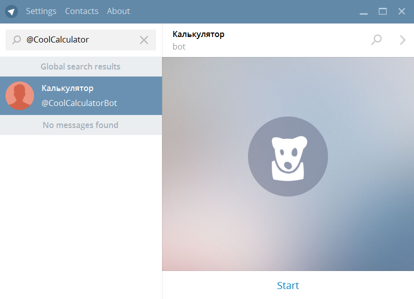

<b>FitClubBot<b/>

## Оглавление

1. [Основные возможности](#общие-сведения)
    1. [общие сведения](#общие-сведения)
    2. [регистрация и авторизация пользователей](#авторизация-пользователей)
    3. [формирование карты клиента](#формирование-карты)
    4. [оплата карты клиента](#оплата-карты-клиента)
    5. [отправка расписания занятий клиенту в формате PDF по e-mail](#отправка-расписания-занятий-клиенту-в-формате-PDF-по-e-mail)
2. [Стек технологий и модули](#Стек-технологий-и-модули)
3. [Регистрация бота](#Регистрация-бота)
4. [Запуск и отладка](#Запуск-и-отладка)

------------
## Основные возможности

## общие сведения

>Чат-боты – это некий помощник, который общается с пользователями посредством сообщений и обладает множеством специфичных функций. Чат - бота можно использовать как для рассылки информации, так и для ее сбора. На сегодняшний день мессенджеры пользуются большим спросом, это связано c изменением в области мобильного интернета: высокие скорости, низкая цена и широкое распространение смартфонов. Прогрессивность мессенджеров можно сравнить с явлением десятилетней давности – взрывом социальных медиа. Уже сейчас приложениями для обмена сообщениями пользуются 2 миллиарда человек, и если верить прогнозам, к 2021 году число пользователей увеличится до 2,48 миллиардов.Чат-боты – это некий помощник, который общается с пользователями посредством сообщений и обладает множеством специфичных функций. Чат - бота можно использовать как для рассылки информации, так и для ее сбора.

>На сегодняшний день мессенджеры пользуются большим спросом, это связано c изменением в области мобильного интернета: высокие скорости, низкая цена и широкое распространение смартфонов. Прогрессивность мессенджеров можно сравнить с явлением десятилетней давности – взрывом социальных медиа. Уже сейчас приложениями для обмена сообщениями пользуются 2 миллиарда человек, и если верить прогнозам, к 2021 году число пользователей увеличится до 2,48 миллиардов. 

<b>FitClubBot</b> — это бот, цель которого заключается в формировании пользователем клиентских карт из услуг, предоставляемых фитнес-клубом с выбором даты и времени предоставления услуги. Клиент может оплатить созданную карту. После оплаты на e-mail клиента приходит PDF файл с расписанием занятий по данной карте клиента.

[🔼Оглавление](#Оглавление)

## регистрация и авторизация пользователей

Регистрация и авторизация пользователя в боте происходит по e-mail и паролю и реализованы следующим образом: при первичном добавлении бота, пользователь должен отправить ему команду /start (это стандартно и предусмотрено Telegram). Следующим шагом, пользователь регистрируется и следует подсказкам ботао. 

Без регистрации и авторизации пользователь не сможет работать в системе.

[🔼Оглавление](#Оглавление)

## формирование карты клиента

Пользователю доступны следующие действия по формированию карты клиента:
- выбор категории предоставляемой услуги;
- выбор услуги в категории;
- выбор даты в пределах текущего месяца;
- выбор времени тренировки в течении рабочего времени клуба;
- редактирование корзины услуг путем удаления последней услуги в корзине;
- создание карты клиента (при этом корзина услуг обнуляется);
- формирование заказа с учетом стоимости логистики товара от склада поставщика до дислокации клиента;
- формирование и создание неограниченного количества карт клиента;
- просмотр своих карт клиента с детализацией их содержания

## оплата карты клиента

После создания карты пользователь может произвести оплату
В приложении реализован механизм оплаты, предоставляемый Telegram через Яндекс.Касса. В данном проекте платежная система работает в тестовом режиме
, но в рабочий режим переводится очень просто после получения реальной регистрации и открытии счета на Яндекс.Касса. Для проведения тестового платежа
данные кредитной карты следующие: 1111 1111 1111 1026 срок действия 12/22 CVC код 000

[🔼Оглавление](#Оглавление)

## отправка расписания занятий клиенту в формате PDF по e-mail

После того, как карта клиента будет оплачена, в приложении формируется расписание занятий в соответствии с составом услуг в карте в формате PDF и направляется на e-mail(указанный клиентом при регистрации) клиенту.

[🔼Оглавление](#Оглавление)

## Стек технологий и модули

1) [python3](https://www.python.org/ "python3") — высокоуровневый язык программирования, ориентированный на повышение производительности разработчика и читаемости кода. 

2) [django2.2](https://www.djangoproject.com/ "django2.2") — фреймворк для веб-приложений на языке Python, использующий шаблон проектирования MVC. 

3) [djangorestframework3.11](https://www.django-rest-framework.org/ "djangorestframework3.11") — Django фреймворк для создания API

4) [pyTelegramBotAPI](https://github.com/eternnoir/pyTelegramBotAPI "pyTelegramBotAPI") — простая, но расширяемая реализация Python для Telegram Bot API.

5) [emojis](https://pypi.org/project/emojis/ "emojis") — Emoji для Python.

7) [fpdf](https://pypi.org/project/fpdf/ "fpdf") - это простой пакет, позволяющий создавать PDF-документы любой сложности напрямую из Python’a.

[🔼Оглавление](#Оглавление)

## Регистрация бота

Для управления ботами в Telegram используется специальный бот [@BotFather](https://telegram.me/BotFather "@BotFather"). Для создания нового бота отправьте команду `/newbot`.

BotFather предложит ввести название нового бота и имя пользователя для аккаунта бота. Название отображается в окне диалога с ботом, а имя пользователя используется для ссылок на него.

В ответном сообщении приходит токен который нужен для управления ботом через API. Записывать токен не обязательно, всегда можно получить его снова командой `/token`.
В случае если токен стал известен кому-то ещё кроме вас нужно сгенерировать новый токен командой `/revoke`.

Старый токен перестанет работать.

Найдем нового бота в поиске

Пока не добавляйте бота в контакты. Как видите в окне описания пусто. Установим текст который будет выводится в окне добавления бота. Для этого отправьте BotFather команду `/setdescription`.

Описание отображается в окне с заголовком "What can this bot do?". Текст описания ограничен 512 символами, допустимы переводы строк.

Для изменения описания бота в окне информации о пользователе отправьте BotFather команду `/setabouttext`.

Текст описания в этом окне ограничен 120 символами. Бот также выдает что текст не должен содержать переводы строк, но текст с ними нормально принимается.

Если бот уже добавлен в контакты то после команд /setabouttext, /setdescription и /setuserpic описание в клиенте обновляется не сразу. Помогает перезапустить клиент, или удалить разговор с ботом и снова его добавить.

Самая заметная часть описания - аватар. Для его изменений введите команду BotFather `/setuserpic`.

После её ввода отправьте BotFather изображение которое станет аватаром бота. Аватар используется в двух местах - в описании пользователя и в изображении в списке контактов. Причем в контактах изображение обрезается в форме круга.

Все возможности можно посмотреть с помощью команды `/help`.

**Внимание: token – единственный идентификационный ключ к боту. Нигде не выкладывайте его, иначе другие люди смогут управлять Вашим ботом. Бот с данным token на момент выкладывания статьи удалён.**

[🔼Оглавление](#Оглавление)

## Запуск и отладка

1. Установить все зависимости с `requirements.txt`.
3. Запустить файл bot.py.
3. Открыть телеграмм(месенджер) и в поиске найти @FitClubBot или @sp_fit_bot и нажать старт. 

[🔼Оглавление](#Оглавление)

